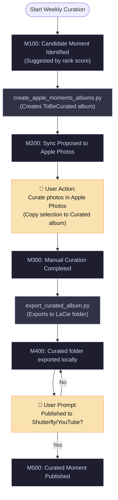

# Pipeline Architecture Visualizations & Direct-Rank Bypass Proposal

This document outlines the proposed changes to the pipeline orchestration flow to support two key requests:
1. **Pipeline Visualizations**: Providing a clear graphical map of both Track 1 (Monthly Ingest) and Track 2 (Weekly Moments Curation) workflows.
2. **Curation Bypass / Retroactive Sync Branch**: Designing a pathway for monthly batches (like `2026-07`) to bypass waiting for Google AI curation, while still allowing late-arriving Google Favorites to sync retroactively without blocking the pipeline.

---

## 📢 Pipeline Process Visualizations

### 1. Track 1: Batch Management (Monthly Ingest & Storage Lifecycle)
This track handles the lifecycle of raw photos for each month, starting with smart album detection and ending with Google Drive cleanup.

```mermaid
flowchart TD
    classDef state fill:#1e1e2e,stroke:#cdd6f4,stroke-width:1px,color:#cdd6f4;
    classDef action fill:#313244,stroke:#a6adc8,stroke-width:1px,color:#cdd6f4;
    classDef decision fill:#45475a,stroke:#f9e2af,stroke-width:1px,color:#f9e2af;
    classDef prompt fill:#f9e2af,stroke:#fab387,stroke-width:1.5px,color:#11111b;
    
    Start([Start Batch]) --> T1_000["000: Initialized in DB"]:::state
    T1_000 --> Act_Verify["verify_smart_album.py"]:::action
    Act_Verify --> Dec_AlbumExist{"Album exists?"}:::decision
    
    Dec_AlbumExist -- "No" --> Prompt_CreateAlbum["👤 User Prompt:<br/>Create Smart Album & press Enter"]:::prompt
    Prompt_CreateAlbum --> Act_Verify
    Dec_AlbumExist -- "Yes" --> T1_100["100: Smart Album Verified"]:::state
    
    T1_100 --> Act_Export["export_photos_wrapper.py"]:::action
    Act_Export --> T1_200["200: Exported to Staging"]:::state
    
    T1_200 --> Act_Dedupe["deduplicate_assets.py"]:::action
    Act_Dedupe --> T1_210["210: Deduplicated & Ready"]:::state
    
    T1_210 --> Dec_Seq{"Sequencing OK?"}:::decision
    Dec_Seq -- "No" --> Prompt_Seq["👤 User Prompt:<br/>Ignore continuity gaps?"]:::prompt
    Prompt_Seq -- "Yes" --> Act_Upload["upload_to_google_photos.py"]:::action
    Prompt_Seq -- "No" --> Abort([Abort/Skip Batch])
    Dec_Seq -- "Yes" --> Act_Upload
    
    Act_Upload --> Dec_Quota{"Did all files fit?"}:::decision
    Dec_Quota -- "No (Partial)" --> T1_399["399: Partial Upload"]:::state
    Dec_Quota -- "Yes (Full)" --> T1_400["400: Upload Completed"]:::state
    
    T1_399 --> Act_Upload
    
    T1_400 --> Prompt_Curation["👤 User Prompt:<br/>Curation completed?"]:::prompt
    Prompt_Curation -- "Yes (y)" --> T1_500["500: Curation Done"]:::state
    Prompt_Curation -- "Bypass" --> T1_500_Bypass["500: Direct-Rank Bypassed"]:::state
    Prompt_Curation -- "No (N)" --> T1_400
    
    T1_500 --> Dec_Favs{"Google AI generated Favorites?\n(Or Starring done?)"}:::decision
    T1_500_Bypass --> Dec_Favs
    
    Dec_Favs -- "Yes (Standard)" --> Act_Pull["pull_google_favorites.py"]:::action
    Dec_Favs -- "No (Bypass)" --> Act_Pull
    
    Act_Pull --> T1_550["550: Google Favorites Pulled"]:::state
    T1_550 --> Act_Rank["rank_assets_by_score.py"]:::action
    Act_Rank --> T1_600["600: Assets Ranked & Scored"]:::state
    
    T1_600 --> Act_Cleanup["delete_google_assets.py"]:::action
    Act_Cleanup --> T1_650["650: Storage Cleaned Up"]:::state
```

---

### 2. Track 2: Memory Feature & Publishing (Weekly Moments Workflow)
This track operates independently and uses the ranked/scored assets from Track 1 to suggest, curate, and publish event-based memories.

---

## 🧠 Design Proposal: Curation Bypass & Retroactive Favorites Sync

For months like `2026-07`, Google AI may never generate a "Best of Month" album, and you may want to proceed to create moments based solely on Apple Photos' aesthetic scores. However, if Google AI *later* generates memories (or you curate them later), we want to capture those favorites without breaking the pipeline.

### Proposed Changes

#### 1. Add a "Direct Rank Bypass" Pathway
* **Current Behavior**: If a month has `0` favorites, the planner prints a warning and halts unless forced, and it keeps recommending waiting for Google AI curation.
* **Proposed Behavior**: 
  * We will add an option to proceed with **"Aesthetic Rank Only"** (Bypass). 
  * If selected, the batch transitions to `550` and `600` immediately with 0 favorites.
  * In the database, we will flag this batch as `is_bypassed = 1` or track that it was ranked with 0 Google favorites.

#### 2. Delayed Storage Cleanup (`650`) for Bypassed Batches
* **Current Behavior**: Once a batch is ranked (`600`), the next step is automatic cleanup (`650`), which deletes the raw photos from Google Photos.
* **Proposed Behavior**:
  * If a batch was bypassed, we **delay the cleanup step (650)** for 14 days (or a configurable grace period).
  * This keeps the photos on your Google Photos account, giving Google AI more time to index and cluster them.

#### 3. Retroactive Favorites Sync for Existing Moments
* **Current Behavior**: `pull_google_favorites.py` only pulls favorites for active batches in step `500` or `550`.
* **Proposed Behavior**:
  * We will add a retroactive check in `pull_google_favorites.py`. 
  * If run, it will fetch new favorites from Google Photos. If it finds any favorited photo that belongs to a month that has already been bypassed and had moments created:
    * It will update `is_google_favorite = 1` in the database.
    * It will **specifically target only the assets that are part of your curated/created moments** for that month, updating their metadata and boosting their ranking in the DB, without needing to re-rank the hundreds of deleted/raw staging photos.

---

## 🛠️ Verification Plan

### Automated Tests
1. Run `python3 scripts/pipeline_planner.py --no-sync` and verify the display of the status table.
2. Test database queries for setting and querying the new bypass metadata flag.

### Manual Verification
1. Proceed with a mock bypassed batch and check that step `650` is successfully delayed.
2. Verify that running the retroactive favorites fetch updates only the assets in curated moments.
