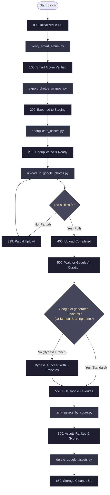
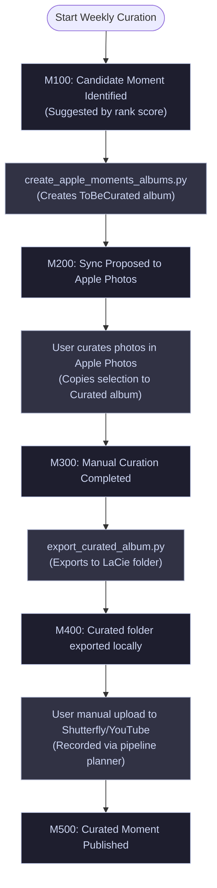

# 📋 Media Organizer Pipeline Architecture

This document outlines the pipeline orchestration flow and design patterns for both Track 1 (Monthly Ingest) and Track 2 (Weekly Moments Curation) workflows.

---

## 🚀 Two-Track Pipeline Architecture

The system is orchestrated by `scripts/pipeline_planner.py` which manages two independent tracks:

### Track 1: Batch Management (Monthly Ingest & Storage Lifecycle)
This track handles the lifecycle of raw photos for each month, starting with smart album detection and ending with Google Drive cleanup.

---

### Track 2: Memory Feature & Publishing (Weekly Moments Workflow)
This track operates independently and uses the ranked/scored assets from Track 1 to suggest, curate, and publish event-based memories.

---

## 🧠 Curation Bypass & Retroactive Favorites Sync Design

For months where Google Photos AI does not automatically create a "Best of Month" album, the pipeline supports a direct bypass mode to prevent blocking the monthly progress:

### 1. Direct-Rank Bypass Mode
If a month has `0` favorites, you can choose `bypass` during the manual curation task check in `pipeline_planner.py`. This updates the status code to `500` (Google AI Curation Complete) and marks the batch as bypassed in the database (`is_bypassed = 1`, `bypass_timestamp = datetime('now')`).

### 2. Grace Period Delayed Storage Cleanup (650)
For bypassed batches, the pipeline enforces a **14-day grace period** during which the automatic cleanup step (`650` - which deletes the raw photos from Google Photos) is skipped. This keeps the photos on Google Photos longer, giving the backend AI more time to index and cluster them.

### 3. Automatic Retroactive Favorites Sync
During the startup bootstrap check of each planner session, the system queries the Google Photos API for favorites. If it detects any bypassed batches (`is_bypassed = 1`), it automatically retrieves the media items in the corresponding curating album and checks if any late-arriving favorites exist.
* To keep operations targeted and efficient, it will **only update the favorites status for assets that belong to created/curated moments** for that month.
* The normalized score (in `ranked_assets_view`) automatically recalculates to include the retroactive favorite weight, updating your published moments without requiring you to re-rank the whole batch.
